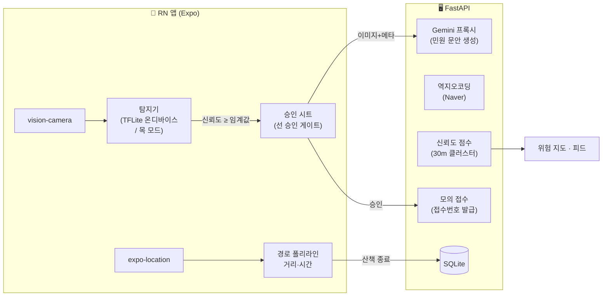

# 아키텍처

## 확정 스택 · 배포 구성

- **웹 프론트(React/Vite)** → Vercel (자동 HTTPS). 카메라 getUserMedia + Geolocation + Leaflet(OSM, 키 불필요)
- **백엔드(FastAPI)** → Docker. TLS 종료를 플랫폼에 맡기는 곳(Cloud Run/Railway) 권장 —
  "인증서" 는 웹 카메라의 HTTPS 요건 때문이며, 이 경우 직접 발급이 불필요.
  자체 VM이면 Caddy 리버스 프록시(Let's Encrypt 자동)
- **추론** = 서버 YOLO(`/infer`, best.pt 그대로 사용 — 모델 변환 불필요).
  `MODEL_PATH` 미설정이면 absent → 프론트 목 모드 폴백
- **LLM** = Gemini API (서버 프록시, 키는 서버에만)
- **DB** = Supabase PostgreSQL (`DATABASE_URL`, 미설정 시 로컬 SQLite)
- `app/`(React Native + TFLite 온디바이스)은 로드맵용 프로토타입으로 보존 — 데모 대상 아님

## 전체 구성



## 원칙

1. **지각과 판정의 분리.** YOLO는 픽셀만 본다(4클래스 세그멘테이션). "신고할 것인가"는
   코드가 결정한다: damaged 클래스 + 신뢰도 임계값 + 30m 중복 제거.
2. **선(先) 승인.** 완전 자동 제출 없음. 임계값 이상만 알람 → 사용자가 문안까지 확인 후
   승인해야 접수. 임계값 미만은 알람 없이 지도 데이터로만 축적.
3. **LLM은 서술만.** 구조화 필드(유형·주소·시각·좌표·사진)는 코드가 채우고, Gemini는
   캡처 이미지를 보고 `{제목, 내용}`만 생성한다(JSON 스키마 강제, 관찰 사실만 서술).
   API 키는 서버에만 존재. 실패 시 템플릿 문장 폴백 — 접수 플로우는 절대 안 막힌다.

## 탐지기 (app/src/detection)

| 모드 | 파일 | 설명 |
|------|------|------|
| 목(기본) | `mockDetector.ts` | 일정 간격으로 탐지 이벤트 발생, 캡처는 실제 카메라 스냅샷 사용. 모델 없이 전체 UX 동작 |
| 온디바이스 | `tfliteDetector.ts` + `decodeYoloSeg.ts` | vision-camera 프레임 프로세서(1~2 FPS) → 640×640 리사이즈 → yolo11n-seg TFLite → 박스 디코딩 + NMS |

전환: `src/config.ts`의 `USE_TFLITE` 플래그. 클래스 매핑(학습과 동일):

```
0 sidewalk_normal / 1 sidewalk_damaged / 2 braille_normal / 3 braille_damaged
알람 대상 = 1, 3 (damaged만)
```

세그멘테이션 마스크 디코딩(proto 행렬)은 미구현 — 박스 우선. 폴백 사다리:
박스 강등 → 서버 추론(FastAPI 엔드포인트로 프레임 전송)으로 전환.

## 신뢰도 점수 (server/app/services/scoring.py)

같은 지점(반경 30m·동일 클래스) 탐지를 클러스터로 묶어 점수 합산:

- AI 최초 발견 +30 / 사용자 승인 +30 / 다른 사용자 재탐지 +20 / 반복 관측 +10 (100 상한)
- 점수 구간별 지도 마커 색상: 30 미만 회색 / 30~59 노랑 / 60~89 주황 / 90+ 빨강

## 민원 접수 (데모 = 모의)

안전신문고는 공개 접수 API가 없다. 데모는 `POST /reports`가 모의 접수번호를 발급한다.
실서비스 설계: 인앱 웹뷰 반자동(최초 1회 로그인 — 인증번호는 사용자 폰에서 입력 — 후
세션 유지, 폼·사진 자동 주입, 사용자는 제출 버튼만). 시설물 파손은 생활불편 민원이라
전용 카메라 요건이 없어 영상 캡처 프레임을 증빙으로 쓸 수 있다.

## 데이터 모델 (SQLite)

- `walks` — 산책 세션: 경로(JSON), 거리, 시간, 사진 경로, 통계
- `detections` — 탐지 이벤트: 클래스, 신뢰도, 좌표, 캡처 경로, 사용자 검증 결과(정탐/오탐)
- `reports` — 승인된 신고: 민원 제목·내용, 접수번호, 처리 상태
- 마커·피드는 위 테이블에서 파생 (별도 테이블 없음)
